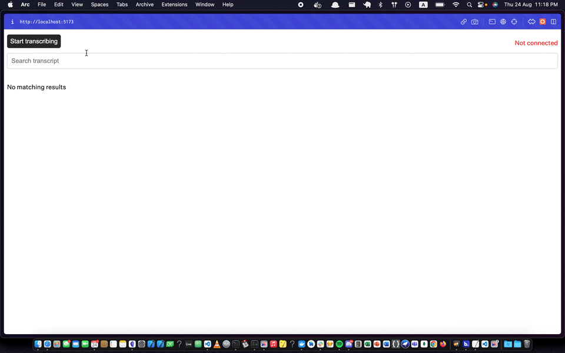

# Svelte frontend for WhisperLive

This is a svelte frontend for the realtime implementation of whisper by collabora.

https://github.com/collabora/WhisperLive

## Demo



## Usage

1. Clone the repo

```bash
git clone git@github.com:yehiaabdelm/transcription-app.git
```

2. Install dependencies

```bash
cd transcription-app
npm i
```

3. Create a .env and add the websocket url. Follow the collabora/WhisperLive repo to dockerize and deploy the transcription server.

```bash
PUBLIC_WEBSOCKET_URL="wss://9090.example.com/"
```

4. Run the app

```bash
npm run dev
```
